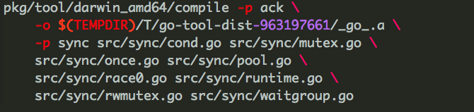
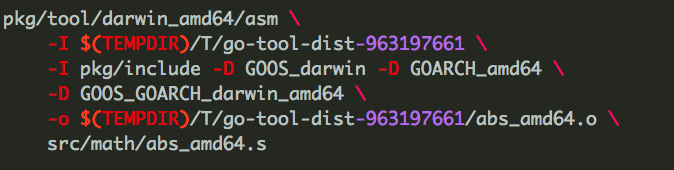
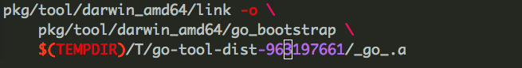

### cmd/dist工具
dist工具，是go语言的一个引导工具，用来检查和设置相关路径和一些全局环境变量。其中要特别注意的是$GOOS和$GOARCH。$GOOS代表编译目标操作系统，$GOARCH代表编译目标的体系结构。这些参数是为交叉编译所准备的。

Go1.5 中，cmd/dist工具已经被go重新了，因此需要Go1.4来编译。编译命令如下：
> /usr/local/Cellar/go/1.4.2/libexec/bin/go build -o cmd/dist/dist ./cmd/dist

一旦cmd/dist编译完成后，make.bash就会调用 ```bash eval $(./cmd/dist/dist env -p || echo FAIL=true) ``` 来设置环境变量。以我所在的机器为例:
> CC=clang   
> CC_FOR_TARGET=clang   
> GOROOT=/Users/wangjing/.opt/go  
> GOBIN=/Users/wangjing/.opt/go/bin  
> GOARCH=amd64  
> GOOS=darwin   
> GOHOSTARCH=amd64  
> GOHOSTOS=darwin  
> GOTOOLDIR=/Users/wangjing/.opt/go/pkg/tool/darwin_amd64

完成环境变量的设置后，make.bash就会调用 ```./cmd/dist/dist bootstrap -a -v``` 命令开始编译自引导、编译器、go_bootstrap等工具。

cmd/dist命令主要有以下几个功能：
> banner		  打印安装的路径等信息  
> bootstrap    重新编译go  
> clean        清除已编译的go文件  
> env [-p]     打印go相关环境变量  
> install [dir] 安装包和工具  
> test [-h]    运行go测试文件和case  
> version      打印go版本

这里要重点分析的是bootstrap过程，其他过程忽略。bootstrap过程的代码定义在src/cmd/dist/build.go的cmdbootstrap函数中，主要的代码流程如下：

```go 
   if rebuildall { 
		clean()  // 如果没有指定 --no-clean 参数则先卸载原有的go程序
	}

	setup()     // 创建 $GOROOT下面的 bin, pkg目录 

	bootstrapBuildTools() // 编译bootstrap工具集。其实就是asm, go的编译器，还有链接器
   
   // 设置环境变量
	os.Setenv("GOHOSTARCH", gohostarch)
	os.Setenv("GOHOSTOS", gohostos)
	os.Setenv("GOARCH", goarch)
	os.Setenv("GOOS", goos)

	// 编译安装一部分依赖库和标准库
	for _, dir := range buildorder {
		install(dir)
	}

	// Build runtime for actual goos/goarch too.
	if goos != gohostos || goarch != gohostarch {
	    // 因为之前构建的是目标平台的runtime包，如果目标平台和本次编译过程运行时平台不一致
	    // 那么还需要为本次编译时的运行平台编译一个runtime包，否则接下来的编译工具会
	    // 无法使用正确的runtime包。这是go的交叉编译的一部分
		install("runtime")
	}
```

bootstrapBuildTools函数中有一个比较有意思的细节。它先将cmd/asm, cmd/compilers, cmd/link等包先拷贝到 $GOROOT/pkg/bootstrap/src/bootstrap中去，然后修改这几个包的import路径，再利用Go1.4编译这几个包。这样做的原因是，cmd中的原始包，需要留给稍后的go_bootstrap命令来编译生成Go1.5版本的bootstrap。bootstrapBuildTools运行完成后，pkg/bootstrap目录如下：


接下来编译标准库和cmd/go命令。因为go语言存在包依赖问题，所以首先被编译的是一些基础的包，编译是有序的，首先编译runtime，sync，encoding等基础核心包，这些包的顺序可以在src/cmd/dist/build.go 中定义的 buildorder数组变量找到。最后再编译cmd/go命令，这个命令最后被重命名为go_bootstrap。大体的过程如下：
> 1. 使用bootstrap/compiler编译对应包的所有.go文件。譬如sync包的编译命令为:  
> 
> 2. 如果包中存在汇编语言编写的源文件(譬如math包，为了利用某些硬件功能加速计算)，则调用bootstrap/asm命令来编译汇编文件  
> 
> 3. 调用bootstrap/link 将库和中间文件链接，最后生成 go_bootstrap命令  
> 
